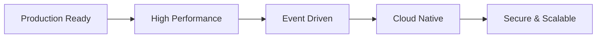
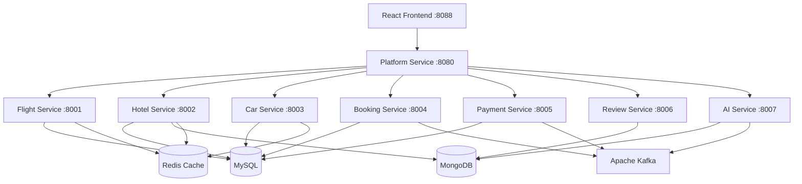
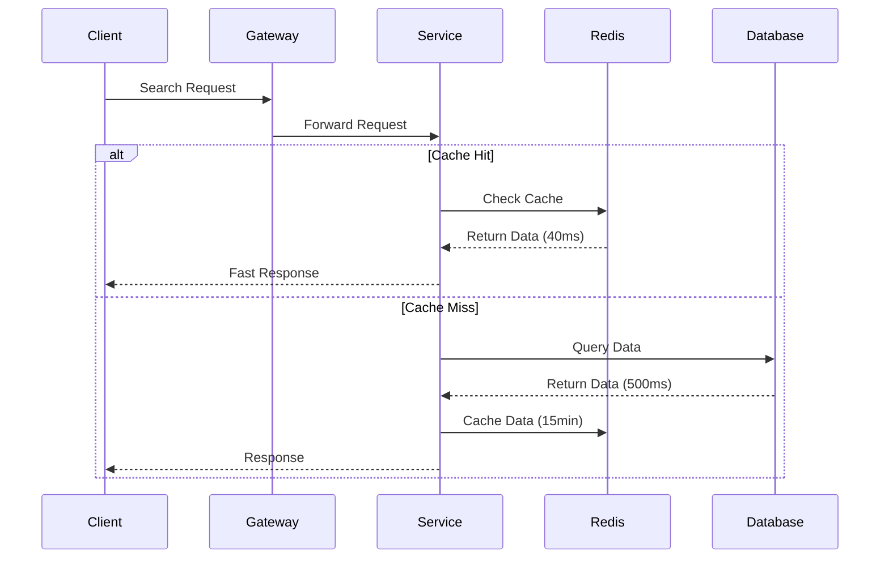
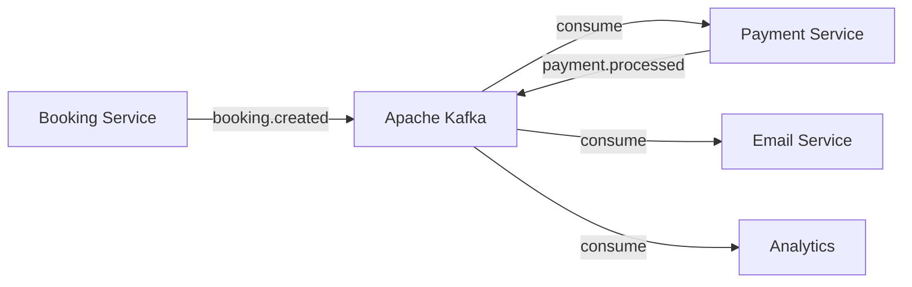
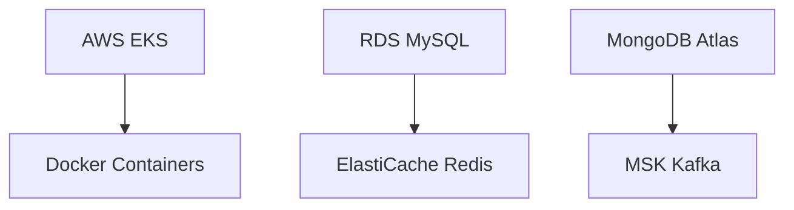
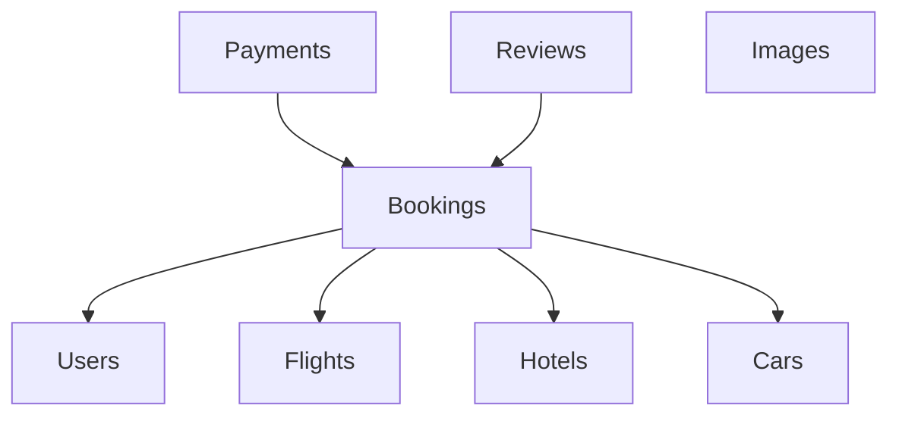
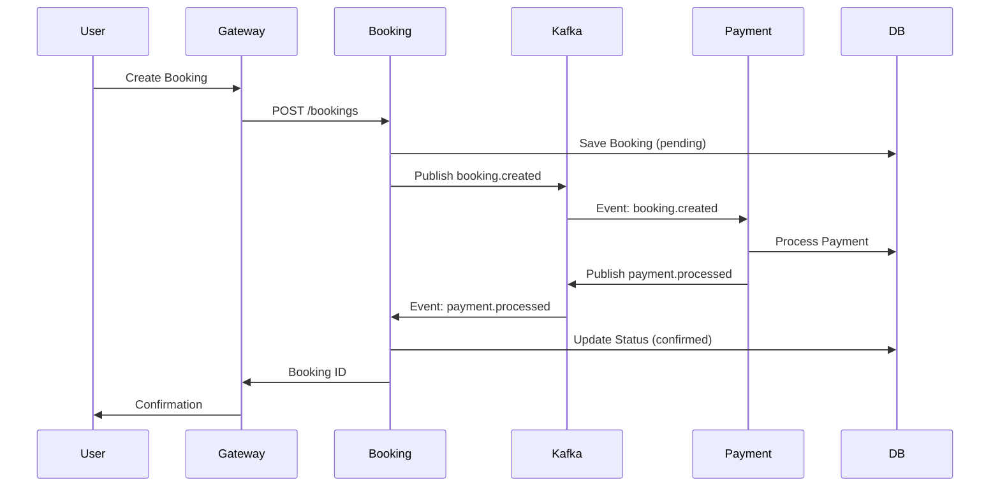

# 🌍 TripWeave - Cloud-Native Travel Booking Platform

<div align="center">


[](https://microservices.io/)
[](https://www.docker.com/)
[](https://kubernetes.io/)

### ✨ A production-grade, event-driven travel booking platform built with modern microservices architecture

[🚀 Quick Start](#-quick-start) • [📚 Documentation](#-table-of-contents) • [🏗️ Architecture](#-architecture-overview) • [🛠️ Tech Stack](#-tech-stack)

---

</div>

## 📋 Table of Contents

- [Overview](#-overview)
- [Key Features](#-key-features)
- [Architecture Overview](#-architecture-overview)
- [Tech Stack](#-tech-stack)
- [Quick Start](#-quick-start)
- [Database Setup](#-database-setup)
- [Running the Application](#-running-the-application)
- [API Documentation](#-api-documentation)
- [Microservices](#-microservices-details)
- [Event-Driven Architecture](#-event-driven-flow)
- [Deployment](#-deployment)
- [Monitoring](#-monitoring--performance)
- [Troubleshooting](#-troubleshooting)

---

## 🌟 Overview

**TripWeave** is a comprehensive, cloud-native travel booking platform implementing modern distributed systems patterns. Built with **8 microservices**, it features event-driven architecture, hybrid databases, and intelligent caching for enterprise-grade performance.

### 🎯 What You Can Do

| Feature | Description |
|---------|-------------|
| ✈️ **Flights** | Search & book domestic/international flights with seat selection |
| 🏨 **Hotels** | Reserve hotel rooms with image galleries and reviews |
| 🚗 **Cars** | Rent vehicles at airports and city locations |
| 🎁 **Bundles** | Combined flight + hotel packages with special discounts |
| 🤖 **AI Assistant** | Gemini-powered travel concierge for smart recommendations |
| 📊 **Analytics** | Real-time dashboards for admins with booking insights |

### 💡 Why TripWeave?



---

## ✨ Key Features

<table>
<tr>
<td width="50%">

### 🎨 User Experience
- 🔐 JWT Authentication
- 💳 Secure Payment Processing
- ⭐ Reviews & Ratings
- 📧 Email Notifications
- 📱 Responsive Design
- 🎯 Smart Search

</td>
<td width="50%">

### 🏗️ Technical Excellence
- ⚡ 92% Faster Searches (Redis)
- 🔄 Async Event Processing
- 🐳 Full Docker Support
- ☸️ Kubernetes Ready
- 📊 Real-time Monitoring
- 🤖 AI-Powered Features

</td>
</tr>
</table>

---

## 🏗️ Architecture Overview

### System Architecture Diagram



### Request Flow with Caching



### Event-Driven Architecture



---

## 🛠️ Tech Stack

<table>
<tr>
<td width="33%">

### Frontend
- ⚛️ React 18.2
- 🎨 Custom CSS3
- 🔄 React Router 6
- 📊 Recharts
- 🔐 JWT Auth

</td>
<td width="33%">

### Backend
- 🟢 Node.js 20+
- 🚀 Express.js 4.18
- 🐍 Python FastAPI
- 🔑 JWT Tokens
- 🔒 bcrypt

</td>
<td width="33%">

### Data & Events
- 🗄️ MySQL 8.0
- 🍃 MongoDB 6.0
- ⚡ Redis 7
- 📨 Kafka
- 🔍 Elasticsearch

</td>
</tr>
</table>

### Infrastructure Stack



---

## 🚀 Quick Start

### Prerequisites

```bash
✅ Node.js >= 20.0
✅ Docker >= 24.0
✅ MySQL >= 8.0
✅ MongoDB >= 6.0
```

### One-Command Setup 🎉

```bash
# Clone the repository
git clone https://github.com/kayakteam10/kayak.git
cd kayak

# Start everything with Docker Compose
cd services
docker-compose up -d

# Access the app
open http://localhost:8088
```

### What Gets Started?

| Service | Port | Status |
|---------|------|--------|
| 🌐 Frontend | 8088 | ✅ Running |
| 🚪 API Gateway | 8080 | ✅ Running |
| ✈️ Flight Service | 8001 | ✅ Running |
| 🏨 Hotel Service | 8002 | ✅ Running |
| 🚗 Car Service | 8003 | ✅ Running |
| 📋 Booking Service | 8004 | ✅ Running |
| 💳 Payment Service | 8005 | ✅ Running |
| ⭐ Review Service | 8006 | ✅ Running |
| 🤖 AI Service | 8007 | ✅ Running |
| 🗄️ MySQL | 3307 | ✅ Running |
| 🍃 MongoDB | 27017 | ✅ Running |
| ⚡ Redis | 6379 | ✅ Running |
| 📨 Kafka | 9094 | ✅ Running |

---

## 🗄️ Database Setup

### Database Architecture



### Quick Setup

**Automatic (Docker):**
```bash
docker-compose up -d mysql mongodb
# Databases auto-initialized with schema + data ✅
```

**Manual MySQL Setup:**
```sql
CREATE DATABASE tripweave_db;
USE tripweave_db;
SOURCE database/01-complete-schema-new.sql;
SOURCE database/02-dummy-data.sql;
```

### Sample Data Loaded

- 👥 10,000 Users
- ✈️ 50,000 Flights
- 🏨 10,000 Hotels
- 🚗 5,000 Cars
- 📋 100,000 Bookings
- ⭐ 50,000 Reviews

---

## 🏃 Running the Application

### Option 1: Docker (Recommended) 🐳

```bash
cd services
docker-compose up -d

# View logs
docker-compose logs -f platform-service

# Scale a service
docker-compose up -d --scale flight-service=3

# Stop everything
docker-compose down
```

### Option 2: Manual Development

```bash
# Start infrastructure
cd services
docker-compose up -d mysql mongodb redis kafka

# Start each microservice (separate terminals)
cd services/platform-service && npm run dev    # Port 8080
cd services/flight-service && npm run dev      # Port 8001
cd services/hotel-service && npm run dev       # Port 8002
# ... repeat for other services

# Start frontend
cd frontend && npm start                       # Port 8088
```

### Access Points 🌐

| Interface | URL | Purpose |
|-----------|-----|---------|
| 🌐 **Frontend** | http://localhost:8088 | User Interface |
| 🚪 **API Gateway** | http://localhost:8080 | REST APIs |
| 📊 **Kafka UI** | http://localhost:8092 | Monitor Events |
| ⚡ **Redis Commander** | http://localhost:8091 | Cache Browser |
| 🍃 **Mongo Express** | http://localhost:8081 | DB Admin |

---

## 📡 API Documentation

### Authentication

```bash
# Register
curl -X POST http://localhost:8080/auth/register \
  -H "Content-Type: application/json" \
  -d '{
    "email": "user@tripweave.com",
    "password": "SecurePass123!",
    "first_name": "John",
    "last_name": "Doe"
  }'

# Login
curl -X POST http://localhost:8080/auth/login \
  -H "Content-Type: application/json" \
  -d '{"email": "user@tripweave.com", "password": "SecurePass123!"}'
```

### Search & Booking

```bash
# Search Flights
GET /api/flights/search?from=SFO&to=JFK&date=2025-12-20&passengers=2

# Search Hotels
GET /api/hotels/search?location=San%20Francisco&checkIn=2025-12-15&checkOut=2025-12-17

# Create Booking
POST /api/bookings
{
  "booking_type": "flight",
  "flight_id": 123,
  "total_amount": 517.50
}
```

---

## 🔧 Microservices Details

<table>
<tr>
<th>Service</th>
<th>Port</th>
<th>Tech</th>
<th>Database</th>
<th>Features</th>
</tr>
<tr>
<td>🚪 Platform</td>
<td>8080</td>
<td>Node.js</td>
<td>MySQL</td>
<td>API Gateway, Auth, Routing</td>
</tr>
<tr>
<td>✈️ Flight</td>
<td>8001</td>
<td>Node.js</td>
<td>MySQL + Redis</td>
<td>Search, Seats, Caching</td>
</tr>
<tr>
<td>🏨 Hotel</td>
<td>8002</td>
<td>Node.js</td>
<td>MySQL + Mongo + Redis</td>
<td>Search, Images, Caching</td>
</tr>
<tr>
<td>🚗 Car</td>
<td>8003</td>
<td>Node.js</td>
<td>MySQL + Redis</td>
<td>Search, Rentals, Caching</td>
</tr>
<tr>
<td>📋 Booking</td>
<td>8004</td>
<td>Node.js</td>
<td>MySQL + Kafka</td>
<td>Order Orchestration, Events</td>
</tr>
<tr>
<td>💳 Payment</td>
<td>8005</td>
<td>Node.js</td>
<td>MySQL + Kafka</td>
<td>Payments, Event-Driven</td>
</tr>
<tr>
<td>⭐ Review</td>
<td>8006</td>
<td>Node.js</td>
<td>MongoDB</td>
<td>Reviews, Ratings</td>
</tr>
<tr>
<td>🤖 AI</td>
<td>8007</td>
<td>Python</td>
<td>MySQL + Kafka</td>
<td>Gemini AI, Deals, Chat</td>
</tr>
</table>

---

## 🔄 Event-Driven Flow

### Booking Workflow



### Kafka Topics

| Topic | Producer | Consumer | Purpose |
|-------|----------|----------|---------|
| `booking.created` | Booking Service | Payment Service | Trigger payment |
| `payment.processed` | Payment Service | Booking Service | Confirm booking |
| `booking.cancelled` | Booking Service | Payment Service | Refund |
| `ai.deals.updated` | AI Service | Domain Services | Update deals |

---

## 🚀 Deployment

### Docker Compose (Local)

```bash
cd services
docker-compose up -d
```

### Kubernetes (Production)

```bash
cd k8s

# Build & push images to ECR
./build-and-push.sh

# Create EKS cluster
./create-cluster.sh

# Deploy all services
./deploy.sh

# Get LoadBalancer URL
kubectl get service platform-service
```

### Architecture on K8s

- ☸️ 8 Deployments (microservices)
- 🌐 LoadBalancer (Platform Service)
- 📊 Auto-scaling (HPA)
- 🔍 Health Checks
- 📦 ConfigMaps & Secrets

---

## 📊 Monitoring & Performance

### Performance Gains

| Operation | Without Cache | With Redis | Improvement |
|-----------|---------------|------------|-------------|
| Flight Search | 500ms | 40ms | **⚡ 92% faster** |
| Hotel Search | 450ms | 35ms | **⚡ 92% faster** |
| Car Search | 400ms | 30ms | **⚡ 92% faster** |

### Health Checks

```bash
# Individual services
curl http://localhost:8001/health  # Flight
curl http://localhost:8002/health  # Hotel

# Aggregate health (admin)
curl -H "Authorization: Bearer <token>" \
  http://localhost:8080/admin/health
```

---

## 🔧 Troubleshooting

### Quick Fixes

```bash
# MySQL not connecting?
docker-compose restart mysql
docker logs kayak-mysql

# Port already in use?
lsof -ti:8080 | xargs kill -9

# Reset everything
docker-compose down -v
docker-compose up -d
```

### Default Test Users

| Email | Password | Role |
|-------|----------|------|
| admin@tripweave.com | admin123 | Admin |
| john.doe@email.com | password123 | User |

---

## 📚 Project Structure

```
TripWeave/
├── 🌐 frontend/              # React app
├── ⚙️ services/              # Microservices
│   ├── platform-service/    # API Gateway (8080)
│   ├── flight-service/      # Flights (8001)
│   ├── hotel-service/       # Hotels (8002)
│   ├── car-service/         # Cars (8003)
│   ├── booking-service/     # Bookings (8004)
│   ├── payment-billing-service/  # Payments (8005)
│   ├── review-service/      # Reviews (8006)
│   ├── ai-service/          # AI (8007)
│   └── docker-compose.yml   # Infrastructure
├── 💾 database/             # SQL schemas
├── ☸️ k8s/                  # Kubernetes manifests
└── 📝 README.md             # This file
```

---

## 🎯 Key Achievements

✅ **8 Microservices** with independent scaling  
✅ **Event-Driven** architecture with Kafka  
✅ **92% Performance** improvement with Redis  
✅ **Kubernetes Ready** with full manifests  
✅ **Production Grade** SOLID principles  
✅ **AI-Powered** Gemini integration  
✅ **Full Docker** support  
✅ **Hybrid Database** MySQL + MongoDB  

---

## 📄 License

Educational project for **Distributed Systems** course.

---

## 💬 Support

- 📧 Email: support@tripweave.com
- 🐛 Issues: [GitHub Issues](https://github.com/kayakteam10/kayak/issues)
- 📖 Docs: [Wiki](https://github.com/kayakteam10/kayak/wiki)

---

<div align="center">

### ⭐ Star this repo if you found it helpful!

**Made with ❤️ by Team TripWeave**

[⬆️ Back to Top](#-tripweave---cloud-native-travel-booking-platform)

</div>
